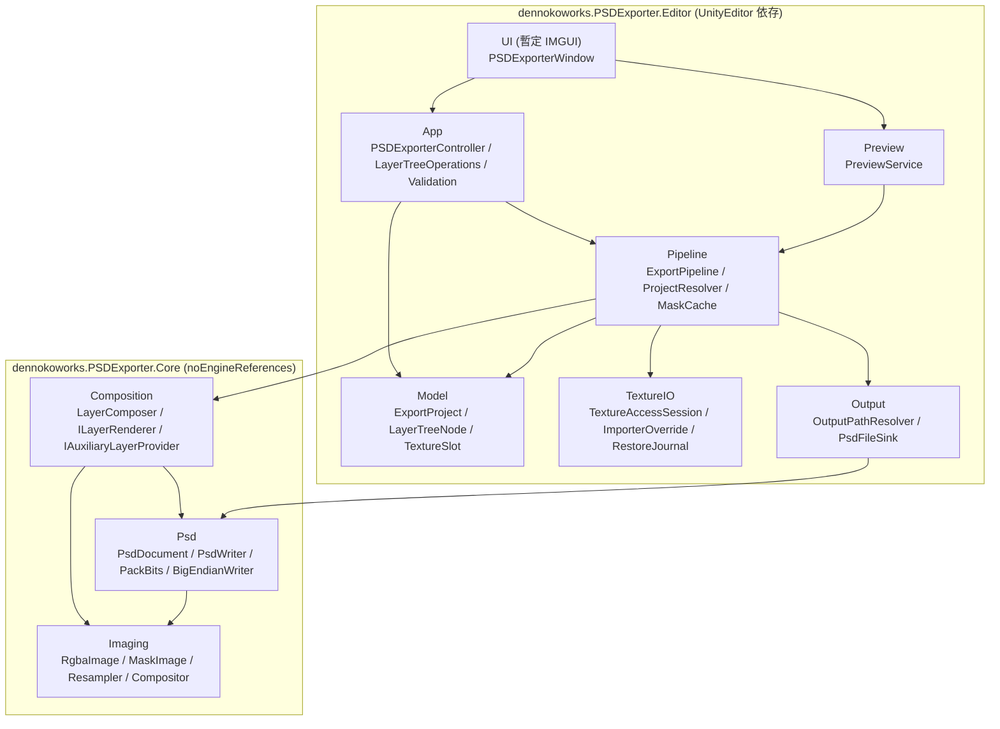
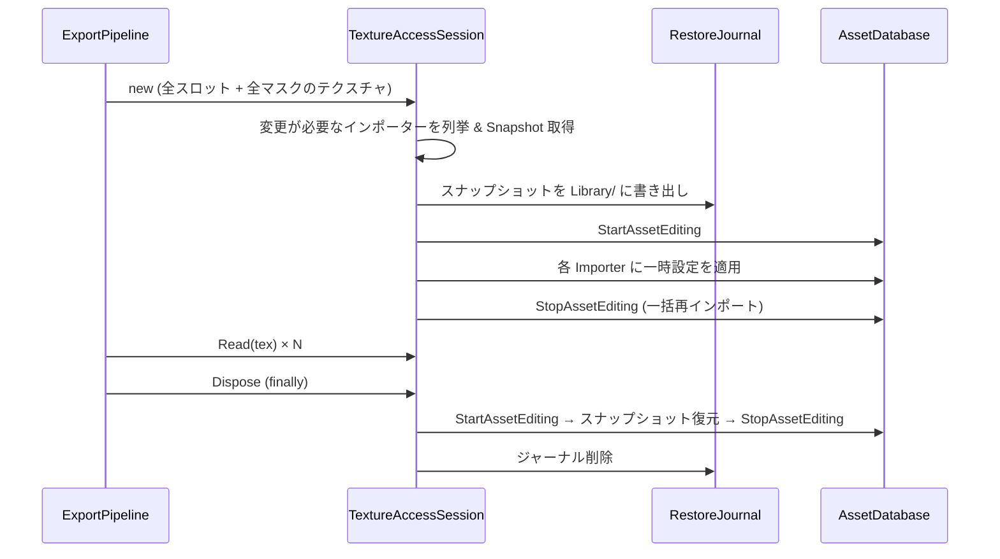

# PSD Exporter 詳細実装計画書 (implementation_plan.md)

> 対象要件: [overview.md](./overview.md)
> 方針: **疎結合・モジュール分割**を最優先し、機能の保守・追加・変更がモジュール単位で閉じるように設計する。
> UI は暫定実装 (IMGUI) とし、後のリファクタリングで差し替えられるよう、UI からロジックを完全に分離する。

---

## 1. 設計方針

| # | 方針 | 具体策 |
|---|------|--------|
| P1 | 依存方向を一方向に固定する | `UI → App → Pipeline → (TextureIO / Output / Core)` の一方向のみ。下位層は上位層を知らない。 |
| P2 | Unity 非依存部分を最大化する | PSD バイナリ生成・画像処理・レイヤー合成は `noEngineReferences: true` の Core アセンブリに置き、純粋な C# (byte 配列) で完結させる。EditMode テストが容易になる。 |
| P3 | 拡張点はインターフェース + 戦略パターン | 切り抜き方式・補助レイヤー (背景/未分類)・テクスチャ読み込み方式・出力先を差し替え可能にする。 |
| P4 | 副作用を境界に閉じ込める | TextureImporter 書き換え・ファイル I/O・AssetDatabase 操作は専用モジュールのみが行い、`IDisposable` スコープで確実に原状復帰する。 |
| P5 | UI は「状態の表示」と「コマンド発行」だけ | UI は `PSDExporterController` のメソッドを呼ぶだけで、モデル操作・検証・エクスポートのロジックを持たない。 |
| P6 | 大容量メモリを流さない | レイヤーを 1 枚ずつ生成 → 即 RLE 圧縮 → 生ピクセル破棄のストリーミング処理にする。 |

### 1.1 overview.md からの変更点・補足

| 項目 | overview.md | 本計画 | 理由 |
|------|-------------|--------|------|
| Core の依存 | UnityEngine のみ依存 | **UnityEngine にも非依存** (`noEngineReferences`) | テスト容易性・再利用性。Unity 型 (`Texture2D`, `Color32`) との変換は Editor 側の TextureIO が担う。 |
| ファイル構成 | Core 3 ファイル / Editor 3 ファイル | 下記 §3 のサブモジュール構成 | 単一ファイルへの責務集中 (特に `PSDExportProcessor`) を避ける。 |
| インポート設定の一時変更 | `isReadable` のみ | `isReadable` に加え **圧縮・最大サイズ・NPOT・テクスチャタイプ・プラットフォーム上書き** も一時変更 | `isReadable` だけでは圧縮済み (劣化) ピクセルや `maxTextureSize` で縮小されたピクセル、ノーマルマップのスウィズル済みピクセルが取得されてしまうため。§8.3 参照。 |
| クラッシュ時の復元 | try-finally | try-finally **+ 復元ジャーナル** | Unity 自体がクラッシュした場合にも次回起動時に復元できるようにする (非機能要件 5-2 の強化)。 |

---

## 2. アーキテクチャ全体像



**依存ルール**
* `Core.Imaging` は何にも依存しない (最下層)。
* `Core.Psd` は `Core.Imaging` の型 (ピクセルバッファ) のみ参照可。レイヤーツリーや切り抜き方式は知らない。
* `Core.Composition` は `Imaging` と `Psd` を使うが、Unity 型・ファイル I/O は知らない。
* `Editor.Model` は純粋なデータ ([Serializable]) のみ。ロジックを持たない。
* `Editor.UI` は `App` と `Preview` 以外を直接参照しない。

---

## 3. ディレクトリ・ファイル構成

```
PSDExporter/
├── Docs/Impl/
│   ├── overview.md
│   └── implementation_plan.md            # 本書
│
├── Core/                                  # asm: dennokoworks.PSDExporter.Core (Editor only, noEngineReferences)
│   ├── dennokoworks.PSDExporter.Core.asmdef
│   ├── Imaging/
│   │   ├── RgbaImage.cs                   # RGBA8 ピクセルバッファ (左上原点, 行優先)
│   │   ├── MaskImage.cs                   # 1ch 8bit マスクバッファ
│   │   ├── BilinearResampler.cs           # バイリニアリサイズ (RgbaImage / MaskImage)
│   │   ├── MaskOps.cs                     # 合併 (max)・反転・乗算などのマスク演算
│   │   └── AlphaCompositor.cs             # 通常ブレンドの over 合成 (マージ画像/プレビュー用)
│   ├── Psd/
│   │   ├── Model/
│   │   │   ├── PsdDocument.cs             # キャンバスサイズ + レイヤーレコード列 + マージ画像
│   │   │   ├── PsdLayerRecord.cs          # 1 レコード (通常レイヤー / グループ開始 / グループ終端)
│   │   │   ├── PsdChannelData.cs          # チャンネルID + 圧縮済みバイト列
│   │   │   ├── PsdLayerMask.cs            # レイヤーマスク矩形・既定色
│   │   │   ├── PsdSectionType.cs          # lsct 種別 enum (Normal/OpenFolder/ClosedFolder/BoundingDivider)
│   │   │   └── PsdBlendMode.cs            # ブレンドモード enum ↔ 4文字キー変換
│   │   ├── Encoding/
│   │   │   ├── BigEndianWriter.cs         # BE 書き込み + 長さプレフィックスのバックパッチ
│   │   │   ├── PackBitsEncoder.cs         # 行単位 RLE (PackBits)
│   │   │   ├── ChannelEncoder.cs          # 画像 → 圧縮チャンネル (行バイト数テーブル付き)
│   │   │   └── PsdStringEncoder.cs        # Pascal 文字列 (ASCII フォールバック) / Unicode (luni)
│   │   ├── Sections/
│   │   │   ├── HeaderSectionWriter.cs
│   │   │   ├── ColorModeDataSectionWriter.cs
│   │   │   ├── ImageResourcesSectionWriter.cs
│   │   │   ├── LayerAndMaskSectionWriter.cs
│   │   │   ├── AdditionalLayerInfoWriter.cs # luni / lsct
│   │   │   └── ImageDataSectionWriter.cs    # マージ済み画像
│   │   └── PsdWriter.cs                   # 上記セクションを順に呼ぶファサード
│   └── Composition/
│       ├── LayerSpec.cs                   # 合成用の純粋ツリー (GroupSpec / MaskLayerSpec)
│       ├── CompositionRequest.cs          # ソース画像 + LayerSpec ツリー + オプション
│       ├── CompositionOptions.cs          # CutoutMode / IncludeBackground / IncludeUnassigned / 名前
│       ├── CutoutMode.cs                  # TransparentCutout / LayerMask
│       ├── Renderers/
│       │   ├── ILayerRenderer.cs          # マスクレイヤー 1 枚分のピクセル生成戦略
│       │   ├── TransparentCutoutRenderer.cs
│       │   ├── LayerMaskRenderer.cs
│       │   └── LayerRendererFactory.cs    # CutoutMode → ILayerRenderer
│       ├── Auxiliary/
│       │   ├── IAuxiliaryLayerProvider.cs # 自動生成レイヤー (背景/未分類) の拡張点
│       │   ├── BackgroundLayerProvider.cs
│       │   └── UnassignedLayerProvider.cs
│       ├── ComposedLayer.cs               # 生成済みレイヤー (ピクセル + 属性) ※ストリーム要素
│       ├── LayerTreeFlattener.cs          # ツリー → 下から上の PSD レコード順 (グループ区切り挿入)
│       └── LayerComposer.cs               # CompositionRequest → PsdDocument
│
├── Editor/                                # asm: dennokoworks.PSDExporter.Editor (Editor only)
│   ├── dennokoworks.PSDExporter.Editor.asmdef
│   ├── Model/
│   │   ├── ExportProject.cs               # 全設定のルート ([Serializable])
│   │   ├── TextureSlot.cs                 # 入力テクスチャ + 出力サフィックス + 有効フラグ
│   │   ├── LayerTreeNode.cs               # 抽象ノード ([SerializeReference])
│   │   ├── GroupNode.cs
│   │   ├── MaskLayerNode.cs
│   │   ├── ExportOptions.cs               # 切り抜き方式・背景・未分類・読み込み品質
│   │   └── OutputSettings.cs              # 出力フォルダ・接頭辞・上書きポリシー
│   ├── App/                               # ※ UnityEngine.Application との名前衝突を避けるため "App"
│   │   ├── PSDExporterState.cs            # ExportProject を保持する ScriptableObject (Undo/Serialize 用)
│   │   ├── PSDExporterController.cs       # UI から呼ばれる唯一の窓口
│   │   ├── LayerTreeOperations.cs         # 追加/削除/移動/グループ化 (純粋なモデル操作)
│   │   └── Validation/
│   │       ├── IProjectValidationRule.cs
│   │       ├── ProjectValidator.cs
│   │       ├── ValidationMessage.cs
│   │       └── Rules/                      # 1 ルール 1 クラス
│   │           ├── NoEnabledSlotRule.cs
│   │           ├── MissingMaskTextureRule.cs
│   │           ├── EmptyLayerNameRule.cs
│   │           ├── OutputFolderRule.cs
│   │           └── DuplicateOutputNameRule.cs
│   ├── TextureIO/
│   │   ├── ITexturePixelReader.cs         # Texture2D → RgbaImage
│   │   ├── TextureAccessSession.cs        # 1 エクスポート中のインポーター変更を一括管理 (IDisposable)
│   │   ├── ImporterSettingsSnapshot.cs    # 変更前設定のスナップショット (JSON 化可能)
│   │   ├── ImporterOverridePolicy.cs      # どの設定をどう一時変更するか
│   │   ├── ImporterRestoreJournal.cs      # クラッシュ復元用ジャーナル (Library/ に保存)
│   │   ├── ImporterRestoreOnLoad.cs       # [InitializeOnLoad] で未復元ジャーナルを処理
│   │   ├── Readers/
│   │   │   ├── ReadableTextureReader.cs   # GetPixels32 + 上下反転
│   │   │   └── GpuReadbackReader.cs       # インポーター非対象 (非アセット/Packages 内) 用フォールバック
│   │   └── UnityImageConverter.cs         # Color32[] ↔ RgbaImage / MaskImage ↔ Texture2D
│   ├── Pipeline/
│   │   ├── ExportPipeline.cs              # エクスポート全体のオーケストレーション
│   │   ├── ExportContext.cs               # 実行中の共有状態 (キャンセル・進捗・レポート)
│   │   ├── ProjectResolver.cs             # Model (Texture2D 参照) → Core の LayerSpec (ピクセル) 変換
│   │   ├── MaskCache.cs                   # (マスク, チャンネル, 解像度) キーのマスク共有キャッシュ
│   │   ├── IProgressReporter.cs
│   │   ├── EditorProgressReporter.cs      # DisplayCancelableProgressBar 実装
│   │   ├── ExportReport.cs                # スロットごとの成否・出力パス・警告
│   │   └── ExportException.cs
│   ├── Output/
│   │   ├── OutputPathResolver.cs          # 接頭辞 + サフィックス + サニタイズ + 衝突処理
│   │   ├── IPsdFileSink.cs
│   │   └── PsdFileSink.cs                 # 一時ファイル書き込み → アトミック置換 → 必要なら ImportAsset
│   ├── Preview/
│   │   ├── PreviewService.cs              # 縮小解像度で合成しサムネイル/全体プレビューを生成
│   │   └── PreviewTextureCache.cs         # 生成 Texture2D の所有と DestroyImmediate
│   └── UI/                                # ★暫定。後で全面差し替え予定
│       ├── PSDExporterWindow.cs           # MenuItem: dennokoworks/PSD Exporter
│       ├── Sections/
│       │   ├── SlotListSection.cs
│       │   ├── LayerTreeSection.cs
│       │   ├── OptionsSection.cs
│       │   ├── OutputSection.cs
│       │   └── PreviewSection.cs
│       └── UIText.cs                      # 表示文字列の集約 (将来のローカライズ/差し替え用)
│
└── Tests/
    └── Editor/                            # asm: dennokoworks.PSDExporter.Tests.Editor
        ├── dennokoworks.PSDExporter.Tests.Editor.asmdef
        ├── Support/PsdTestReader.cs       # テスト専用の最小 PSD パーサ
        ├── Core/ ...                       # §15 参照
        └── Editor/ ...
```

### 3.1 アセンブリ定義

| asmdef | rootNamespace | references | includePlatforms | noEngineReferences |
|--------|---------------|------------|------------------|--------------------|
| `dennokoworks.PSDExporter.Core` | `DennokoWorks.Tool.PSDExporter.Core` | なし | Editor | **true** |
| `dennokoworks.PSDExporter.Editor` | `DennokoWorks.Tool.PSDExporter` | Core | Editor | false |
| `dennokoworks.PSDExporter.Tests.Editor` | `DennokoWorks.Tool.PSDExporter.Tests` | Core, Editor, UnityEngine.TestRunner, UnityEditor.TestRunner | Editor | false |

* 全て `autoReferenced: false` (他ツールからの意図しない参照を防ぐ)。
* 命名は既存ツール (`dennokoworks.DennokoMAT.Core` 等) の規約に合わせる。
* Tests は `defineConstraints: ["UNITY_INCLUDE_TESTS"]` を付け、配布パッケージからは除外可能にする。

---

## 4. Core.Imaging モジュール

### 4.1 データ型

```csharp
// 左上原点・行優先・RGBA 順の 8bit バッファ。Unity の左下原点との変換は TextureIO が担う。
public sealed class RgbaImage
{
    public int Width { get; }
    public int Height { get; }
    public byte[] Pixels { get; }            // length = Width * Height * 4
    public RgbaImage(int width, int height);
    public RgbaImage(int width, int height, byte[] pixels); // 所有権を受け取る
    public RgbaImage Clone();
}

public sealed class MaskImage
{
    public int Width { get; }
    public int Height { get; }
    public byte[] Values { get; }            // length = Width * Height, 0=非選択, 255=選択
    public static MaskImage Filled(int w, int h, byte value);
}
```

**座標系の約束**: Core 内の画像は全て「左上原点」。PSD の行順と一致させ、変換コストを入口 1 か所 (TextureIO) に集約する。

### 4.2 処理

| クラス | API | 備考 |
|--------|-----|------|
| `BilinearResampler` | `RgbaImage Resize(RgbaImage src, int w, int h)` / `MaskImage Resize(MaskImage src, int w, int h)` | ピクセル中心基準 (`(x+0.5)*sx-0.5`)、端はクランプ。同サイズなら入力をそのまま返す (コピーしない)。大幅縮小時のエイリアシングは初期版では許容 (プレビューのみで顕在化)。 |
| `MaskOps` | `MaskImage Union(IEnumerable<MaskImage>)` (max) / `MaskImage Invert(MaskImage)` / `void MultiplyAlpha(RgbaImage, MaskImage)` | 未分類レイヤー・切り抜き処理から利用。 |
| `AlphaCompositor` | `void CompositeOver(RgbaImage dst, RgbaImage src, MaskImage maskOrNull, float opacity)` | 通常ブレンド (straight alpha)。マージ画像生成とプレビューで共用。 |

---

## 5. Core.Psd モジュール (自己完結型 PSDWriter)

### 5.1 責務の境界

`PsdWriter` は **「既に PSD のレコード順に並び、チャンネルが圧縮済みの `PsdDocument`」をバイト列にするだけ**。
レイヤーツリーの平坦化・切り抜き・合成は一切知らない (それは Composition の責務)。

```csharp
public sealed class PsdDocument
{
    public int Width, Height;
    public List<PsdLayerRecord> Layers;     // PSD 仕様どおり「下 → 上」の順
    public RgbaImage MergedImage;           // マージ済みプレビュー (Image Data セクション用)
}

public sealed class PsdLayerRecord
{
    public string Name;
    public PsdRect Bounds;                  // top, left, bottom, right
    public byte Opacity = 255;
    public bool Visible = true;
    public PsdBlendMode BlendMode = PsdBlendMode.Normal;
    public PsdSectionType Section = PsdSectionType.None; // グループ開始/終端なら設定
    public List<PsdChannelData> Channels;   // id: -1(A), 0(R), 1(G), 2(B), -2(User Mask)
    public PsdLayerMask Mask;               // null ならマスクなし
}

public sealed class PsdChannelData
{
    public short Id;
    public ushort Compression;              // 0=Raw, 1=RLE
    public byte[] EncodedBytes;             // 行バイト数テーブル + 圧縮データ (compression 2byte は含まない)
}

public static class PsdWriter
{
    public static void Write(Stream stream, PsdDocument document); // stream は Seek 可能であること
}
```

### 5.2 ファイル構造と実装メモ

| セクション | Writer | 内容 |
|------------|--------|------|
| File Header (26B) | `HeaderSectionWriter` | `8BPS`, version=1, reserved 6B, channels=4, height, width, depth=8, colorMode=3 (RGB) |
| Color Mode Data | `ColorModeDataSectionWriter` | 長さ 0 |
| Image Resources | `ImageResourcesSectionWriter` | 初期版は長さ 0。将来 `0x0421` (Version Info) 等を追加できるよう `IImageResource` リスト受け取り型にしておく |
| Layer and Mask Info | `LayerAndMaskSectionWriter` | 下記詳細 |
| Image Data | `ImageDataSectionWriter` | compression=1 (RLE)、全チャンネル全行のバイト数テーブル → R,G,B,A の順にデータ |

**Layer and Mask Information の詳細**

1. セクション長 (4B, バックパッチ)
2. Layer Info 長 (4B, バックパッチ, **偶数長にパディング**)
3. レイヤー数 (2B, **負数** = マージ画像の先頭アルファがマージ結果の透明度であることを示す)
4. レイヤーレコード × N
   * 矩形 (16B)、チャンネル数 (2B)、チャンネル情報 (id 2B + 長さ 4B ※長さは compression 2B を含む)
   * `8BIM` + ブレンドキー (`norm` 等) + 不透明度 + clipping(0) + flags + filler
     * flags: bit1 = 非表示。グループ/区切りレコードは bit3|bit4 (`0x18`) を立てる
   * Extra data 長 (4B, バックパッチ)
     * Layer Mask data: マスクありなら 20B (矩形 16B + 既定色 1B + flags 1B + padding 2B)、なしなら長さ 0
     * Blending ranges: 長さ 0
     * レイヤー名: Pascal 文字列 (ASCII、非 ASCII は `?`)、**4 バイト境界にパディング**
     * Additional Layer Info (`AdditionalLayerInfoWriter`)
       * `luni`: UTF-16BE の正式レイヤー名 (日本語名対応)
       * `lsct`: グループ関連レコードのみ。種別 (1=開いたフォルダ, 2=閉じたフォルダ, 3=終端区切り) + `8BIM` + `pass` (通過)
5. チャンネル画像データ: レコード順・チャンネル順に `compression(2B) + EncodedBytes`
6. Global Layer Mask Info: 長さ 0

**グループの表現** (Composition 側の `LayerTreeFlattener` が生成する並び):

```
[下] </Layer group>   (lsct=3, 空レイヤー)   ← グループ終端
     子レイヤー...     (下 → 上)
[上] グループ名        (lsct=1 or 2, 空レイヤー) ← グループ本体
```

### 5.3 エンコーディング部品

| クラス | 責務 |
|--------|------|
| `BigEndianWriter` | `WriteUInt16/Int16/UInt32/Int32/Bytes/Ascii4`。`LengthScope BeginLength(int sizeBytes, int alignment)` → `Dispose` で現在位置との差分を書き戻し、必要ならパディング。FileStream に直接書くことでメモリ上に全体を持たない。 |
| `PackBitsEncoder` | 1 行分の byte スパン → PackBits。最悪長 `w + ceil(w/128)` を事前確保しバッファを再利用。 |
| `ChannelEncoder` | `RgbaImage` から指定チャンネル (R/G/B/A) を行ごとに抽出 → PackBits → `[行バイト数 ushort × H][データ]` を返す。`MaskImage` 版も持つ。空レイヤー用に `EmptyChannel()` (Raw, 0 バイト) を提供。 |
| `PsdStringEncoder` | Pascal 文字列 (長さ 1B + 本体、指定境界パディング)、Unicode 文字列 (文字数 4B + UTF-16BE)。 |

### 5.4 制約・検証

* 幅/高さ上限 30000 (PSD 仕様)。超過時は `ArgumentOutOfRangeException`。
* RLE の行バイト数は 2B に収まる (16384px 幅でも最大 16512B)。
* 書き込み検証はテスト用 `PsdTestReader` で読み戻して確認 (§15)。

---

## 6. Core.Composition モジュール

### 6.1 入力 (Unity 非依存の合成リクエスト)

```csharp
public abstract class LayerSpec
{
    public string Name;
    public bool Visible = true;
    public float Opacity = 1f;
}
public sealed class GroupSpec : LayerSpec
{
    public bool Expanded = true;
    public List<LayerSpec> Children;        // UI と同じく「上 → 下」の順
}
public sealed class MaskLayerSpec : LayerSpec
{
    public MaskImage Mask;                  // 既にソース解像度にリサイズ済み
}

public sealed class CompositionRequest
{
    public RgbaImage Source;
    public GroupSpec Root;                  // 仮想ルート
    public CompositionOptions Options;
}

public sealed class CompositionOptions
{
    public CutoutMode CutoutMode = CutoutMode.TransparentCutout;
    public bool IncludeBackground = true;
    public bool IncludeUnassigned = true;
    public string BackgroundLayerName = "Background / 元画像";
    public string UnassignedLayerName = "Base / 未分類";
    public bool TrimLayerBounds = false;    // 将来: 透明領域をトリムしてファイルサイズ削減
}
```

※ リサイズは Pipeline 側 (`MaskCache`) で済ませてから渡す。Composition は「同一解像度」を前提条件として検証のみ行う。

### 6.2 拡張点 1: 切り抜き方式 (`ILayerRenderer`)

```csharp
public interface ILayerRenderer
{
    // 1 枚のマスクレイヤーの内容を生成する
    ComposedLayer Render(RgbaImage source, MaskImage mask, LayerSpec spec);
}
```

| 実装 | 出力 |
|------|------|
| `TransparentCutoutRenderer` | ソースを複製し `alpha = srcAlpha * mask / 255`。マスク 0 → 完全透明、中間値は半透明として保持 (アンチエイリアス境界を維持)。チャンネル: -1,0,1,2 |
| `LayerMaskRenderer` | ソースそのまま (複製不要・参照共有) + ユーザーマスクチャンネル (-2) にマスクを付与。チャンネル: -1,0,1,2,-2 |

新しい方式 (例: 閾値二値化、マスク境界ブリード付き) は `ILayerRenderer` を追加し `LayerRendererFactory` に登録するだけで済む。

### 6.3 拡張点 2: 自動生成レイヤー (`IAuxiliaryLayerProvider`)

```csharp
public enum AuxiliaryPlacement { Bottom }   // 将来 Top 等を追加可能

public interface IAuxiliaryLayerProvider
{
    int Order { get; }                      // 同じ Placement 内での並び (小さいほど下)
    AuxiliaryPlacement Placement { get; }
    bool IsEnabled(CompositionOptions options);
    ComposedLayer Create(CompositionRequest request, ILayerRenderer renderer, IReadOnlyList<MaskImage> allMasks);
}
```

| 実装 | Order | 内容 |
|------|-------|------|
| `BackgroundLayerProvider` | 0 (最下層) | ソースをそのまま (切り抜きなし) |
| `UnassignedLayerProvider` | 1 (背景の直上) | `Invert(Union(全マスク))` をマスクとして `renderer` で生成 → 切り抜き方式と一貫した出力になる |

* 「全マスク」はエクスポート対象の全マスクレイヤー (非表示レイヤーも含む) を対象とする。
* 未分類領域が全て 0 (= 完全に割り当て済み) の場合は警告を出し、レイヤーは空として出力する (スキップするかは §17 の検討事項)。

### 6.4 平坦化と合成 (`LayerTreeFlattener` / `LayerComposer`)

```csharp
public sealed class LayerComposer
{
    public LayerComposer(ILayerRenderer renderer, IEnumerable<IAuxiliaryLayerProvider> auxiliaryProviders);

    // ストリーミング: 1 レイヤー生成 → 即チャンネル圧縮 → 生ピクセル破棄
    public PsdDocument Compose(CompositionRequest request, ICompositionObserver observer = null);
}

public interface ICompositionObserver   // 進捗通知・キャンセル・プレビュー用フック
{
    bool IsCancellationRequested { get; }
    void OnLayerComposed(int index, int total, string name);
}
```

処理手順:
1. `LayerTreeFlattener` がツリーを「下 → 上」の `FlatEntry` 列 (GroupEnd / Layer / GroupBegin) に変換し、各エントリの**実効表示・実効不透明度** (親グループとの積) を算出。
2. 補助レイヤー (Placement=Bottom) を先頭に追加。
3. 下から順に各エントリについて:
   * Layer → `renderer.Render` → `ChannelEncoder` で圧縮 → `PsdLayerRecord` 追加
   * 同時に `AlphaCompositor` でマージ画像へ over 合成 (実効表示が true のもののみ)
   * 生ピクセル (`ComposedLayer`) は参照を切って GC 対象にする
4. GroupBegin/GroupEnd → 空チャンネルの区切りレコード
5. 完成した `PsdDocument` (圧縮済みチャンネル + マージ画像) を返す

**メモリ見積り (4K, マスク 10 枚)**: 生ピクセルは常にソース 64MB + 作業 1 枚 64MB + マージ 64MB 程度に抑えられ、残りは RLE 圧縮済みデータのみとなる。

---

## 7. Editor.Model モジュール

UI やパイプラインから共有される**純粋な設定データ**。ロジックを持たない。

```csharp
[Serializable] public sealed class ExportProject
{
    public List<TextureSlot> Slots = new();
    [SerializeReference] public GroupNode Root = new GroupNode { Name = "<root>" };
    public ExportOptions Options = new();
    public OutputSettings Output = new();
}

[Serializable] public sealed class TextureSlot
{
    public bool Enabled = true;
    public Texture2D Texture;
    public string Suffix = "BaseColor";     // [接頭辞]_[Suffix].psd
}

[Serializable] public abstract class LayerTreeNode
{
    public string Id = Guid.NewGuid().ToString("N"); // UI 選択状態やプレビューキャッシュのキー
    public string Name;
    public bool IncludeInExport = true;     // false ならエクスポート対象外
    public bool Visible = true;             // PSD 上の表示フラグ
    [Range(0, 1)] public float Opacity = 1f;
}

[Serializable] public sealed class GroupNode : LayerTreeNode
{
    public bool Expanded = true;
    [SerializeReference] public List<LayerTreeNode> Children = new(); // 上 → 下
}

[Serializable] public sealed class MaskLayerNode : LayerTreeNode
{
    public Texture2D Mask;
    public MaskChannel Channel = MaskChannel.Luminance; // 白黒マスク or アルファマスク
    public bool InvertMask;
}

[Serializable] public sealed class ExportOptions
{
    public CutoutMode CutoutMode = CutoutMode.TransparentCutout; // Core の enum を再利用
    public bool IncludeBackground = true;
    public bool IncludeUnassigned = true;
    public SourceReadQuality ReadQuality = SourceReadQuality.Original; // §8.3
}

[Serializable] public sealed class OutputSettings
{
    public string Folder = "Assets";        // プロジェクト外の絶対パスも許可
    public string FilePrefix = "Texture";
    public OverwritePolicy Overwrite = OverwritePolicy.Ask; // Ask / Overwrite / AutoRename
    public bool ImportIntoAssetDatabase = true;
}
```

* ツリーは `[SerializeReference]` で多態シリアライズ (Unity 2022.3 対応、ドメインリロード後も保持)。
* 将来「プリセット保存」を追加する場合は `ExportProject` を ScriptableObject/JSON に保存するモジュールを `Editor/Persistence/` に追加するだけで済む。

---

## 8. Editor.TextureIO モジュール

### 8.1 責務

`Texture2D` (Unity アセット) から、**元ファイル品質の `RgbaImage` を取得**し、プロジェクトの状態を必ず元に戻すこと。

```csharp
public interface ITexturePixelReader
{
    bool CanRead(Texture2D texture);
    RgbaImage Read(Texture2D texture);      // 左上原点に変換して返す
}

public sealed class TextureAccessSession : IDisposable
{
    public TextureAccessSession(IEnumerable<Texture2D> textures, ImporterOverridePolicy policy, ImporterRestoreJournal journal);
    public RgbaImage Read(Texture2D texture);   // 適切な Reader を選択
    public void Dispose();                      // 全インポーター設定を復元 (例外を握りつぶさず集約して再送出)
}
```

### 8.2 処理フロー



* 変更は**エクスポート 1 回につき一括**で行い、再インポート回数を最小化する (`StartAssetEditing` / `StopAssetEditing` で囲む)。
* 同じテクスチャがスロットとマスクで重複していても 1 回だけ処理する (`HashSet<string> assetPath`)。

### 8.3 一時変更する設定 (`ImporterOverridePolicy`)

`SourceReadQuality.Original` (既定) のとき:

| 設定 | 一時値 | 理由 |
|------|--------|------|
| `isReadable` | true | ピクセル取得のため (要件 4.4-2) |
| `textureCompression` | Uncompressed | 圧縮劣化したピクセルの取得を防ぐ |
| `crunchedCompression` | false | 同上 |
| `maxTextureSize` | 16384 | 最大サイズ制限による縮小を防ぐ |
| `npotScale` | None | NPOT テクスチャの勝手なリサイズを防ぐ |
| `textureType` | Default (NormalMap の場合) | ノーマルマップのスウィズル (DXT5nm 等) を防ぐ |
| アクティブプラットフォームの上書き設定 | overridden=false | プラットフォーム別の圧縮/サイズ上書きを無効化 |

`SourceReadQuality.AsImported` のときは `isReadable` のみ変更 (インポート結果そのままを出力したい場合用)。

* 現在値が既に目標値と一致するインポーターは変更しない (不要な再インポートと .meta 差分を避ける)。
* `ImporterSettingsSnapshot` は上記項目のみを保持し、復元時も同じ項目のみ書き戻す (他設定を触らない)。

### 8.4 Reader の選択順

1. インポーター変更済み or 元々読み取り可能 → `ReadableTextureReader` (`GetPixels32` → 上下反転)
2. インポーターが存在しない / 変更不可 (非アセットテクスチャ、`Packages/` 内の不変パッケージ) → `GpuReadbackReader` (`RenderTexture` へ Blit → `ReadPixels`)。sRGB/Linear の扱いに注意し、ソースの色空間に合わせた `RenderTextureReadWrite` を指定。警告を `ExportReport` に積む。
3. いずれも不可 → `ExportException`

### 8.5 クラッシュ復元 (`ImporterRestoreJournal` / `ImporterRestoreOnLoad`)

* 変更直前にスナップショット群を JSON で `Library/dennokoworks/PSDExporter/restore_journal.json` に保存。
* 正常終了で削除。
* `[InitializeOnLoad]` の `ImporterRestoreOnLoad` が起動時にファイルの存在を確認し、残っていれば復元を実行してログを出す。
* `Library/` 配下に置くことで VCS に混入しない。

### 8.6 メモリ管理

* `GpuReadbackReader` や変換で生成した一時 `Texture2D` / `RenderTexture` は `try-finally` で `DestroyImmediate` / `RenderTexture.ReleaseTemporary`。
* `Color32[]` → `RgbaImage` 変換後、`Color32[]` の参照を即座に破棄。

---

## 9. Editor.Pipeline モジュール

### 9.1 `ExportPipeline`

```csharp
public sealed class ExportPipeline
{
    public ExportPipeline(
        Func<ImporterOverridePolicy, TextureAccessSession> sessionFactory,
        ProjectResolver resolver,
        OutputPathResolver pathResolver,
        IPsdFileSink sink,
        Func<CutoutMode, LayerComposer> composerFactory);

    public ExportReport Run(ExportProject project, IProgressReporter progress);
}
```

依存は全てコンストラクタ注入。既定の組み立ては `ExportPipeline.CreateDefault()` (static) に集約し、テストでは差し替える。

**処理手順**

```
1. (検証は呼び出し側の PSDExporterController が実行済み。Pipeline は App 層に依存しない)
2. OutputPathResolver で全スロットの出力パスを事前決定 (上書き確認はここで UI に問い合わせ済みであること)
3. using (session = TextureAccessSession(全テクスチャ))
   using (maskCache = new MaskCache(session))
   foreach enabled slot:
       a. source = session.Read(slot.Texture)
       b. request = ProjectResolver.Resolve(project, source, maskCache)
            - MaskLayerNode → MaskLayerSpec (maskCache.Get(mask, channel, invert, source.W, source.H))
            - IncludeInExport=false のノードは除外、空グループは保持
       c. doc = composer.Compose(request, observer = progress)
       d. sink.Write(path, doc)
       e. report.AddSuccess(slot, path) / 例外は report.AddFailure(slot, ex) して次スロットへ
4. finally: session.Dispose() で全インポーター復元、EditorUtility.ClearProgressBar()
5. AssetDatabase.Refresh (出力先が Assets 内かつ ImportIntoAssetDatabase の場合、Sink 側で個別 ImportAsset)
```

### 9.2 `MaskCache`

* キー: `(assetPath/instanceId, MaskChannel, invert, width, height)`
* マスクは 1ch (`MaskImage`) で保持 (4K で 16MB/枚)。スロット間で解像度が同じなら再利用。
* 解像度の異なるスロットが来た場合はネイティブ解像度のマスクからリサイズ (ネイティブ版もキャッシュ)。
* `Dispose` で全参照を解放。

### 9.3 キャンセル・進捗

* `IProgressReporter.Report(float progress, string message)` / `bool IsCancelled`。
* `EditorProgressReporter` が `EditorUtility.DisplayCancelableProgressBar` を実装。
* Composition には `ICompositionObserver` アダプタとして渡し、レイヤー単位でキャンセル判定。
* キャンセル時も finally で復元・一時ファイル削除を行う。

### 9.4 `ExportReport`

* スロットごとの `Success / Failed / Skipped`、出力パス、警告 (GPU 読み込みフォールバック、未分類が空、など)、所要時間。
* UI は結果を表示するだけ。ログ出力もレポートから一括で行う (処理中の `Debug.Log` 乱発を避ける)。

---

## 10. Editor.Output モジュール

| クラス | 責務 |
|--------|------|
| `OutputPathResolver` | `"{Prefix}_{Suffix}.psd"` を組み立て、ファイル名禁止文字をサニタイズ。`Assets/` 相対パスと絶対パスの両方を扱う。重複サフィックス・既存ファイル衝突を検出し `OverwritePolicy` に従って解決 (`AutoRename` なら `_1`, `_2` を付与)。 |
| `IPsdFileSink` | `void Write(string path, PsdDocument doc)` |
| `PsdFileSink` | 同一ディレクトリの一時ファイル (`.psd.tmp`) に `PsdWriter.Write` → 成功後に `File.Replace` / `File.Move` でアトミック置換 → 失敗時は一時ファイル削除。出力先が `Assets/` 配下かつ設定が有効なら `AssetDatabase.ImportAsset`。 |

将来 PNG 個別書き出し等を追加する場合は `IPsdFileSink` と並ぶ別の出力モジュールを追加し、Pipeline で選択する。

---

## 11. Editor.App モジュール (UI との境界)

### 11.1 `PSDExporterState` (ScriptableObject)

* `ExportProject Project` を保持。`hideFlags = HideFlags.DontSave`。
* ウィンドウが `[SerializeField]` で保持し、ドメインリロード後も状態が残る。
* `Undo.RecordObject(state, ...)` で全モデル変更を Undo 対応させる。
* `event Action Changed` と `int Revision` (変更ごとに加算) を公開し、プレビューのキャッシュ無効化に使う。

### 11.2 `PSDExporterController`

UI が呼ぶ唯一のファサード。**UI 技術 (IMGUI / UI Toolkit) に依存しない**。

```csharp
public sealed class PSDExporterController
{
    public PSDExporterController(PSDExporterState state, ExportPipeline pipeline, ProjectValidator validator);

    public ExportProject Project { get; }

    // スロット
    public void AddSlot(Texture2D tex = null);
    public void RemoveSlot(int index);
    public void MoveSlot(int from, int to);

    // レイヤーツリー (LayerTreeOperations に委譲 + Undo 記録 + Changed 通知)
    public MaskLayerNode AddLayer(GroupNode parent, int index, Texture2D mask = null);
    public GroupNode AddGroup(GroupNode parent, int index);
    public void RemoveNode(string nodeId);
    public bool MoveNode(string nodeId, string newParentId, int index); // 循環は拒否
    public void GroupSelection(IReadOnlyList<string> nodeIds);
    public void Modify(string undoName, Action<ExportProject> mutation); // 汎用プロパティ変更

    // 検証・実行
    public IReadOnlyList<ValidationMessage> Validate();
    public ExportReport Export(IProgressReporter progress);
}
```

### 11.3 `LayerTreeOperations`

* 純粋関数的なツリー操作 (`FindById`, `FindParent`, `Insert`, `Remove`, `Move`, `IsAncestor`)。
* Undo・イベントを知らないので単体テストが容易。

### 11.4 Validation

* `IProjectValidationRule { IEnumerable<ValidationMessage> Validate(ExportProject p); }`
* `ProjectValidator` はルール一覧を回すだけ。ルール追加 = クラス追加。
* `ValidationMessage { Severity (Error/Warning/Info), string Text, string NodeIdOrNull }` → UI は該当ノードをハイライト可能。

| ルール | Severity |
|--------|----------|
| 有効なスロットが無い / スロットのテクスチャ未設定 | Error |
| マスク未設定のレイヤー | Error |
| レイヤー名が空 | Warning (既定名で補完) |
| 出力フォルダが存在しない・書き込み不可 | Error |
| スロットのサフィックス重複 | Error |
| スロット間で解像度が異なる | Info (マスクはスロットごとにリサイズされる旨) |
| マスクがソースとアスペクト比が異なる | Warning |

---

## 12. Editor.Preview モジュール

* `PreviewService.GetLayerThumbnail(nodeId, size)` / `GetCompositePreview(slotIndex, maxSize)`
* 生成は Core の `Composition` と `AlphaCompositor` を**縮小解像度 (例: 長辺 512px)** で実行して再利用 (エクスポートと同一ロジックなので見た目の不一致が起きない)。
* ピクセル取得はエクスポートと同じ `TextureAccessSession` を使う。ただしプレビューごとの再インポートは重いため、
  * 初期版: **「プレビュー更新」ボタン押下時のみ**生成 (自動更新しない)。
  * 生成した縮小画像は `(textureGUID, importerHash, size)` をキーにキャッシュし、`PSDExporterState.Revision` 変化時に合成結果のみ無効化。
* 生成 `Texture2D` は `PreviewTextureCache` が所有し、ウィンドウ `OnDisable` で `DestroyImmediate`。
* 既に `isReadable` なテクスチャは再インポートなしで即時生成できるので、将来の自動更新はこの経路から段階的に導入する。

---

## 13. 暫定 UI (Editor.UI)

> **後で全面差し替える前提**。UI 層は `PSDExporterController` / `PreviewService` / `UIText` のみ参照し、ロジックを一切持たない。

### 13.1 構成

`PSDExporterWindow` (IMGUI, `[MenuItem("dennokoworks/PSD Exporter")]`) は、以下のセクションを縦に並べるだけ:

| セクション | 暫定実装 |
|------------|----------|
| `SlotListSection` | `ReorderableList`。各行: 有効トグル / `ObjectField(Texture2D)` / サフィックス。領域へのドラッグ＆ドロップで追加。 |
| `LayerTreeSection` | インデント付きの行リスト (再帰描画)。各行: 展開▶ / 表示トグル / 名前 / マスク `ObjectField` / チャンネル / ↑↓ (並べ替え) / ←→ (グループから出す・直前のグループへ入れる) / 削除。上部に「レイヤー追加」「グループ追加」。マスクテクスチャの複数ドロップで一括レイヤー追加 (名前 = テクスチャ名)。 |
| `OptionsSection` | 切り抜き方式 (EnumPopup)、背景レイヤー、未分類レイヤー、読み込み品質 |
| `OutputSection` | 出力フォルダ (ボタンで `OpenFolderPanel`)、接頭辞、上書きポリシー、出力ファイル名プレビュー |
| `PreviewSection` | 「プレビュー更新」ボタン、スロット選択、合成プレビュー、選択レイヤーのサムネイル |
| フッター | 検証メッセージ (`HelpBox`)、「エクスポート」ボタン (Error があれば無効)、直近の `ExportReport` |

### 13.2 差し替え容易性のためのルール

* 各 Section は `void Draw(PSDExporterController c, UISelection selection)` のみを持つ。
* 選択状態・スクロール位置など UI 固有の状態は `UISelection` など UI 層に閉じる (モデルに入れない)。
* 文字列は全て `UIText` に集約。
* 将来の UI Toolkit / `TreeView` 版は、Controller の API をそのまま使って新規作成し、旧 UI フォルダを削除するだけで移行できる。

---

## 14. 実装フェーズとマイルストーン

各フェーズは前フェーズのみに依存し、完了条件を満たしてから次へ進む。

| Phase | 内容 | 成果物 | 完了条件 |
|-------|------|--------|----------|
| **0. 土台** | フォルダ・asmdef 3 種作成 | asmdef, 空の名前空間 | コンパイルが通る。Core が UnityEngine を参照できないこと |
| **1. PSD 最小書き出し** | `BigEndianWriter`, `PackBitsEncoder`, `ChannelEncoder`, 各 SectionWriter, `PsdWriter` | 単色 1 レイヤー PSD | テスト用コードで生成した PSD が Photoshop / CLIP STUDIO / GIMP / Krita で開ける。PackBits 往復テスト合格 |
| **2. PSD 完全対応** | 複数レイヤー、レイヤーマスク (-2)、`luni`、`lsct` グループ (入れ子)、非表示・不透明度、マージ画像 | Core.Psd 完成 | 入れ子グループ + マスク + 日本語名の PSD が上記 4 アプリで正しく表示される |
| **3. 画像処理・合成** | Core.Imaging, Core.Composition 全体 | `LayerComposer` | 純 C# テストで: 切り抜き結果、未分類 = 反転合併、平坦化順序 (区切り挿入)、実効不透明度、マージ画像が期待値と一致 |
| **4. テクスチャ読み込み** | TextureIO 全体 (Snapshot, Session, Journal, OnLoad, Readers) | 元品質での `RgbaImage` 取得 | 非 Readable・圧縮・NormalMap・maxSize 制限付きテクスチャで元解像度/無劣化のピクセル取得、**例外発生時・キャンセル時に設定が完全復元**されること (.meta 差分なし) |
| **5. パイプライン・出力** | Model, Pipeline, Output, Validation, Controller | ヘッドレスでエクスポート可能 | テストコードから `ExportPipeline.Run` で複数スロット PSD が一括生成される。解像度不一致マスクのリサイズ、上書きポリシー動作 |
| **6. 暫定 UI** | UI 全セクション | EditorWindow | メニューから開き、D&D で素材登録 → エクスポートまで一通り操作可能。Undo 可能。ドメインリロード後も状態保持 |
| **7. プレビュー** | Preview モジュール | サムネイル・合成プレビュー | 手動更新でプレビュー表示。ウィンドウを閉じてもリーク (Texture2D 残存) しない |
| **8. 品質強化** | 4K×複数スロット×マスク 20 枚での性能・メモリ計測、エラーメッセージ整備 | 計測結果 | 4K / 4 スロット / 20 マスクでクラッシュせず完了。ピークメモリを記録し §6.4 の見積りと乖離がないこと |

---

## 15. テスト計画

### 15.1 自動テスト (EditMode, Unity Test Framework)

| 対象 | テスト内容 |
|------|-----------|
| `PackBitsEncoder` | ランダム/全同値/全異値/128 境界の行をエンコード → テスト用デコーダで往復一致 |
| `BigEndianWriter` | エンディアン、長さバックパッチ、偶数/4 バイトパディング |
| `PsdWriter` | `PsdTestReader` で読み戻し: ヘッダ値、セクション長の整合、レイヤー数 (負数)、各レコードの名前 (`luni`)・lsct 種別・マスク矩形、チャンネルデコード結果が入力と一致 |
| `BilinearResampler` | 同サイズ恒等、2 倍拡大/縮小の既知値、端のクランプ |
| `MaskOps` | Union (max)、Invert |
| `TransparentCutoutRenderer` | マスク 0/128/255 でアルファが 0/半分/元値 |
| `LayerMaskRenderer` | RGB がソースと一致し、-2 チャンネルがマスクと一致 |
| `UnassignedLayerProvider` | 2 マスクが重なるケース・全域カバーケース |
| `LayerTreeFlattener` | 入れ子グループの順序 (`GroupEnd, 子..., GroupBegin`)、実効表示・不透明度 |
| `LayerTreeOperations` | 追加・削除・移動・循環移動の拒否 |
| `OutputPathResolver` | サニタイズ、重複、AutoRename |
| `ProjectValidator` | 各ルールの発火条件 |
| `TextureAccessSession` (統合) | テスト用一時アセットを作成し、設定変更 → 読み取り → 例外発生 → 設定が全項目復元されていることを確認。後始末でアセット削除 |

### 15.2 手動検証チェックリスト

* [ ] Photoshop / CLIP STUDIO PAINT / GIMP / Krita で開けるか (各切り抜き方式 × グループ有無)
* [ ] レイヤーマスク保持モードでマスクが編集可能か
* [ ] 日本語レイヤー名が文字化けしないか
* [ ] グループの開閉状態・非表示・不透明度が反映されるか
* [ ] マージ画像 (サムネイル/「互換性優先」読み込み) が正しいか
* [ ] 非 Readable・圧縮・NormalMap テクスチャで元ファイルと同じピクセルになるか (Photoshop で元 PNG と差分 0)
* [ ] エクスポート中キャンセル・Unity 強制終了後に .meta が元に戻るか

---

## 16. 拡張シナリオ別の変更箇所 (保守性の確認)

| やりたいこと | 変更するモジュール | 触らないモジュール |
|--------------|-------------------|-------------------|
| 新しい切り抜き方式を追加 | `Core/Composition/Renderers` に 1 クラス + Factory 登録、`CutoutMode` enum 追加 | Psd, TextureIO, Pipeline, UI (EnumPopup が自動対応) |
| 補助レイヤー追加 (例: AO 乗算レイヤー) | `Core/Composition/Auxiliary` に 1 クラス + Options にフラグ | Psd, TextureIO |
| マスクのブリード (パディング) 処理を追加 | `Core/Imaging` に `MaskBleeder`、`ProjectResolver` か新 Renderer で適用 | Psd, UI 以外ほぼ不変 |
| ブレンドモード指定 | `PsdBlendMode` にキー追加、`LayerTreeNode` にフィールド、`AlphaCompositor` にブレンド関数追加 | TextureIO, Output |
| 16bit PSD 対応 | `Core/Psd` の Header/ChannelEncoder の depth 化、`Imaging` に 16bit バッファ | Composition の戦略インターフェースは不変 |
| 設定のプリセット保存 | `Editor/Persistence` を新設、Controller に Load/Save | Core 全体, Pipeline |
| UI を UI Toolkit に全面変更 | `Editor/UI` を差し替え | それ以外全て |
| 出力形式の追加 (レイヤー別 PNG 等) | `Editor/Output` に新 Sink、Pipeline で選択 | Core.Psd 以外の Core |

---

## 17. リスクと検討事項

| # | 内容 | 対応方針 |
|---|------|----------|
| R1 | Photoshop 以外のアプリで lsct/luni の解釈差 | Phase 2 で 4 アプリ検証を完了条件に含める。問題があれば Pascal 名にも可能な限り情報を持たせる |
| R2 | 一時インポート変更による再インポート時間 (4K 多数) | 一括 `StartAssetEditing`、変更不要なら触らない。進捗バーに「インポート設定を変更中」を表示 |
| R3 | 大量レイヤー時のメモリ | ストリーミング合成 + RLE 即時圧縮。Phase 8 で計測。必要なら `ArrayPool<byte>` 導入 |
| R4 | HDR/16bit ソース (EXR 等) | 初期版は 8bit にクランプして出力し、Warning をレポート |
| R5 | ソースの sRGB/Linear 設定 | バイト値をそのまま扱う (色変換しない)。GPU フォールバック時のみ色空間を明示指定 |
| Q1 | 透過切り抜き時、マスク中間値を半透明にするか二値化するか | **本計画では乗算 (半透明保持) を既定**とする。二値化が必要なら新 Renderer として追加 |
| Q2 | 未分類領域が空のとき、レイヤーを出力するかスキップするか | 初期版は空レイヤーとして出力 + 警告。要望次第でオプション化 |
| Q3 | 背景レイヤーを PSD の真の「背景」(ロック付き) にするか通常レイヤーにするか | 初期版は通常レイヤー (名前のみ「Background / 元画像」)。アルファ付きテクスチャを扱うため |
| Q4 | グループ/レイヤーの初期名・スロットのサフィックス候補 (BaseColor, Normal, …) | `UIText` / 定数として UI 層で提供。モデルは任意文字列 |

---

## 18. 実装時の差分メモ (2026-10-01 プロトタイプ実装)

計画から変更・具体化した点。

| 項目 | 計画 | 実装 |
|------|------|------|
| App 層の名前 | `Editor/Application/` | `Editor/App/` (名前空間 `DennokoWorks.Tool.PSDExporter.App`)。`UnityEngine.Application` との衝突回避 |
| `MaskChannel` | `Editor/Model/MaskChannel.cs` | `Core/Imaging/MaskChannel.cs`。マスク抽出 (`MaskExtractor`) を Core に置いたため。`MaskChannel.Luminance` は「輝度 × アルファ」 |
| テクスチャ取得の抽象 | `TextureAccessSession` を直接使用 | `ITextureSource` を追加し、Pipeline / Preview / MaskCache はこれにのみ依存 |
| 検証の呼び出し位置 | Pipeline の手順 1 | `PSDExporterController.Export` で検証してから Pipeline を実行 (Pipeline → App の逆依存を避ける) |
| `ILayerRenderer.Render` | `(source, mask, spec)` | `(source, mask)`。レイヤー属性は Composer が付与する |
| `IPsdFileSink` | コンストラクタでインポート有無を受け取る | `ResolvedOutput.ImportAfterWrite` で出力ごとに指定 (Sink はステートレス) |
| プレビューの読み込み品質 | 規定なし | 再インポートを減らすため `AsImported` を既定 (`PreviewService.ReadQuality`) |
| 自動テスト (§15.1) | EditMode テスト一式 | **未実装**。今回は構文チェックのみ。Core は Unity 外のスモークテストで PSD 構造 (レコード順・lsct・luni・マスク・RLE・マージ画像) を読み戻して確認済み |
| ジャーナルの扱い | 正常終了で削除 | 復元失敗分は残し、次回セッション開始時にも再試行。未復元エントリがあるテクスチャは再スナップショットせず既存エントリを使う |
