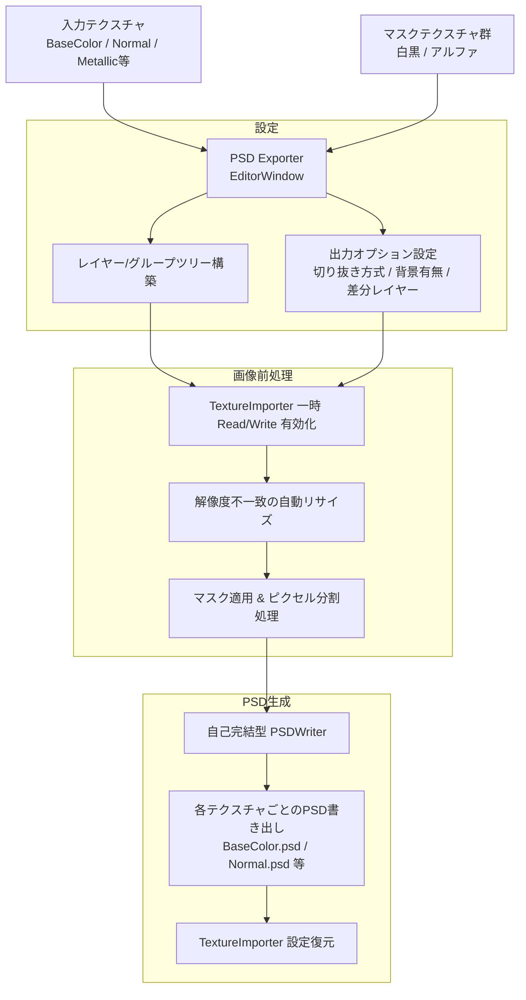

# PSD Exporter 要件定義書 (overview.md)

## 1. 基本情報

* **ツール名**: PSD Exporter
* **メニュー配置**: `dennokoworks > PSD Exporter`
* **対象プラットフォーム / バージョン**: Unity 2022.3.22f1 以降 (Editor 専用拡張)
* **配布形態**: 単独自己完結パッケージ (他アセットへの依存なし)

---

## 2. 目的・背景

### 2.1 目的
VRChat向けアセット（3Dモデル・衣装・小物・アバターテクスチャ等）の制作において、Substance 3D PainterやBlender等で作成したためにレイヤー分けされたPSDが存在しない、または単一のベイク済みテクスチャしか手元にない制作環境において、**完成テクスチャと各種マスク画像を指定するだけで、自動でレイヤー分割されたPSDファイルを生成・書き出し可能にする**こと。

### 2.2 対象ユーザー
* テクスチャ改変用のPSDを配布したいが、制作パイプライン上フラットなテクスチャしか出力できないアセット制作者
* 購入したアセットのテクスチャを部位ごとにレイヤー分けして改変作業（Photoshop / CLIP STUDIO PAINT等）を行いたい改変者

---

## 3. ワークフロー概要



---

## 4. 機能要件

### 4.1 テクスチャ入力管理
1. **複数テクスチャスロット対応 (一括エクスポート)**:
   * 単一のテクスチャだけでなく、同一マテリアルで使用される複数テクスチャ（例: `BaseColor`, `Normal`, `Metallic/Smoothness`, `Emission` 等）をスロットに登録可能とする。
   * 共通のレイヤー構造・マスク設定を適用し、スロットごとに個別のPSDファイル（例: `[名前]_BaseColor.psd`, `[名前]_Normal.psd` 等）を一括書き出しする。
2. **テクスチャの登録方式**:
   * EditorWindow 上へのドラッグ＆ドロップまたは ObjectPicker による指定。

### 4.2 レイヤー・グループ（フォルダ）階層構造
1. **マスクテクスチャとレイヤー名の紐付け**:
   * レイヤーごとに「レイヤー名」「対応するマスクテクスチャ」を指定可能。
2. **フォルダ（グループ）階層のサポート**:
   * UI上でグループ（フォルダ）を作成し、その中にレイヤーをネスト可能。
   * PSD書き出し時にグループ情報（Photoshopのレイヤーグループ規格 `lsct`）を保持して出力する。
3. **並び順の管理**:
   * リスト/ツリー上でレイヤーの重ね順（上下関係）を直感的に変更可能とする。

### 4.3 マスク処理・レイヤー生成仕様
1. **切り抜き方式の切り替え**:
   * 以下のいずれかをエクスポートオプションとして選択可能とする:
     * **透過ピクセル切り抜き**: マスクの白部分（非ゼロ）のみ元テクスチャのピクセルを残し、それ以外を透明（Alpha = 0）にした通常レイヤーとして出力。
     * **レイヤーマスク保持**: 元テクスチャのピクセルデータはそのまま保持し、PSDの「レイヤーマスクチャンネル」としてマスクを付与（Photoshop等で非破壊編集が可能）。
2. **背景レイヤー・差分レイヤーオプション**:
   * **元画像背景レイヤー**: 最下層に切り抜きなしの完全な元テクスチャを「Background / 元画像」として含めるかを選択可能（オン/オフ）。
   * **未マスク差分レイヤー**: いずれのマスク領域にも含まれなかった未割り当ての領域（マスクの反転合成領域）を「Base / 未分類」レイヤーとして自動生成・含めるかを選択可能（オン/オフ）。
3. **パディング処理の前提**:
   * 入力されるマスク画像自体にUV境界パディング（ブリード）があらかじめ付与されている想定とし、初期バージョンではツール側での追加ブリード処理は行わない。

### 4.4 画像前処理・インポート設定管理
1. **解像度不一致時の自動リサイズ**:
   * 元テクスチャの解像度を基準とし、指定されたマスクテクスチャの解像度が異なる場合は、元テクスチャのサイズに合わせて自動でリサイズ（バイリニア補間）して適用する。
2. **TextureImporter の一時 Read/Write 有効化**:
   * ユーザーがインポート設定で `Read/Write Enabled` をオンにしていないテクスチャが指定された場合:
     1. 元の設定状態を記憶する。
     2. 一時的に `isReadable = true` に書き換えて再インポート・ピクセル取得。
     3. エクスポート完了後（または例外発生時）、`try-finally` で元の設定値に確実に復元する。

### 4.5 PSD バイナリ生成・書き出し
1. **自己完結型 PSDWriter**:
   * 外部DLL（Photoshopライブラリ等）に依存せず、純粋なC#でPSDフォーマット（8bit RGB、4チャンネル、RLE PackBits圧縮）を直接生成・ファイル保存する。
   * グループ構造、レイヤーマスク、ブレンドモード（通常）、不透明度、マージ済みプレビュー画像セクションを規格に準拠して書き込む。

### 4.6 UI / UX 仕様
1. **UI形態**:
   * メニューバー `dennokoworks > PSD Exporter` から開く独立した `EditorWindow`。
   * 設定アセット等の事前作成は不要とし、ウィンドウ上で素材を配置して即座に出力できる軽量・ワンストップな操作感。
2. **簡易プレビュー機能**:
   * 各レイヤーのサムネイル表示。
   * 全体合成結果の簡易プレビュー表示。
3. **保存先指定**:
   * 出力先フォルダおよびファイル接頭辞の指定機能。

---

## 5. 非機能要件

1. **外部依存ゼロ (自己完結性)**:
   * 他の dennokoworks 製ツール（`DennokoPSDEditor` 等）がプロジェクトに存在しなくても、`PSDExporter` 単体で完全に動作すること。
2. **堅牢性・原状復帰**:
   * 処理の中断やエラーが発生した場合でも、プロジェクト内のテクスチャインポーター設定が書き換わったまま放置されないこと。
3. **メモリ管理**:
   * 4K解像度テクスチャの複数展開時にヒープ肥大やクラッシュを防ぐため、一時生成した `Texture2D` や中間バッファは `DestroyImmediate` で明示的に破棄すること。

---

## 6. ディレクトリ・コード構成案

```
PSDExporter/
├── Docs/
│   └── Impl/
│       └── overview.md        # 本要件定義書
├── Core/                      # PSDバイナリ書き込みコア (UnityEngineのみ依存)
│   ├── BigEndianBinaryWriter.cs
│   ├── PSDExportData.cs       # レイヤー・グループデータモデル
│   └── PSDWriter.cs           # PSDバイナリエンコーダ (RLE PackBits, レイヤー/マスク/グループ)
└── Editor/                    # エディタ拡張 (UnityEditor依存)
    ├── PSDExporterWindow.cs   # メインGUIウィンドウ (dennokoworks > PSD Exporter)
    ├── PSDExportProcessor.cs  # マスク適用・解像度調整・Importer一時書き換え・実行パイプライン
    └── PSDLayerTreeView.cs    # レイヤー・グループツリーUI
```
